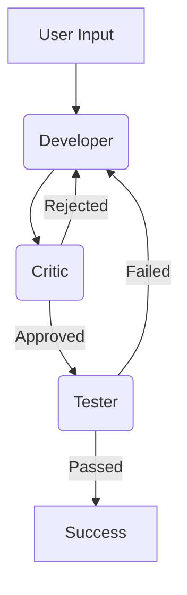

#  Agentic Code Studio


**Agentic Code Studio** is an advanced autonomous software engineering platform that leverages multi-agent collaboration to **detect bugs**, **optimize performance**, and **audit security vulnerabilities**.

Built on the **Actor-Critic** architecture using **LangGraph**, it orchestrates specialized AI agents (Developer, Critic, Tester, Security Expert) to iteratively improve code quality, verifying fixes through unit tests and static analysis.

---

##  Key Features

*   ** Automated Bug Fixing**: A loop of proposing fixes, critiquing logic, and verifying with tests.
*   ** Code Optimization**: Specialized workflows to analyze time/space complexity and refactor code for better performance. Includes automatic test driver generation.
*   ** Security Auditing**: Scans for vulnerabilities (SQLi, XSS, etc.) and proposes secure patches. 
    *   **Specialized Support**: Dedicated checks for **SQL** and **PostgreSQL** injection patterns.
*   ** Multi-Language Support**:
    *   **Python**, **C++**, **Java** (for Logic & Optimization)
    *   **SQL**, **PostgreSQL** (for Security)
*   ** Multi-Agent Collaboration**:
    *   **Developer Agent**: Writes and attempts to fix code.
    *   **Critic Agent**: Reviews code for best practices and logical errors using static analysis.
    *   **Tester Agent**: Generates and executes unit tests (supports Python, C++, Java) to confirm stability.
*   ** Modern Interface**: A slick Next.js dashboard to visualize the agent workflow, diffs, and chat history.

---

##  Architecture

The system uses a directed cyclic graph (DAG) managed by **LangGraph** to control agent state transitions.



##  Getting Started

### Prerequisites

*   **Python 3.9+**
*   **Node.js 18+**
*   **Google Gemini API Key** (or compatible LLM provider)
*   **Java JDK** (for Java testing)
*   **G++ / MinGW** (for C++ testing)

### 1. Clone the Repository

```bash
git clone https://github.com/Kishore-1803/AI-bug-detector-and-optimizer.git
cd AI-bug-detector-and-optimizer
```

### 2. Backend Setup

Initialize the Python environment and install dependencies.

```bash
# Create a virtual environment (optional but recommended)
python -m venv venv
# Windows
.\venv\Scripts\activate
# Mac/Linux
source venv/bin/activate

# Install requirements
pip install -r requirements.txt
```

**Configuration**:
Create a `.env` file in the root directory and add your Google API key:

```ini
GOOGLE_API_KEY=your_gemini_api_key_here
```

### 3. Frontend Setup

Navigate to the Next.js directory and install dependencies.

```bash
cd frontend_next
npm install
```

---

##  Usage

You need to run both the backend server and the frontend client.

**Terminal 1: Backend API**
```bash
# From the root directory
python -m backend.server
# or
cd backend
python server.py
# Server runs on http://localhost:8000
```

**Terminal 2: Frontend UI**
```bash
# From the frontend_next directory
cd frontend_next
npm run dev
# Dashboard runs on http://localhost:3000
```

Open **http://localhost:3000** in your browser to start using the Agentic Code Studio.

---

##  Project Structure

```bash
 backend/
   agents/                 # AI Agent definitions (Developer, Critic, Tester)
   workflows/              # LangGraph Workflows (Bug Fix, Optimization, Security)
   server.py               # FastAPI Backend
 frontend_next/            # Next.js Web Application
 requirements.txt          # Python dependencies
 README.md                 # Documentation
```
